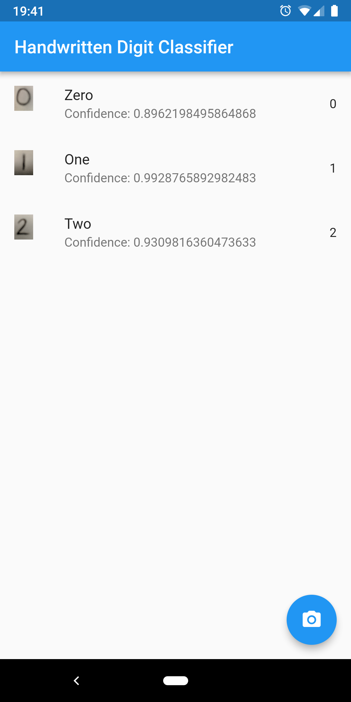
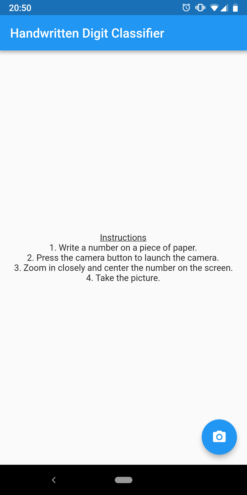
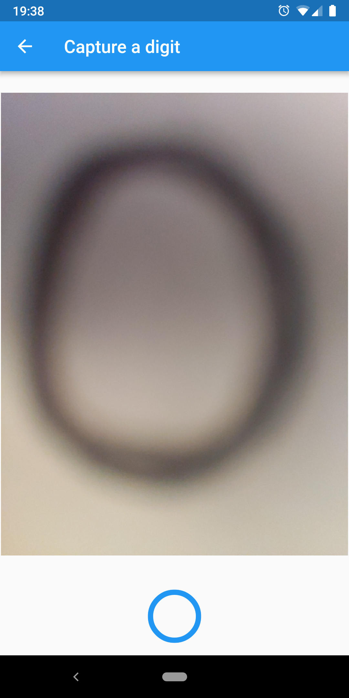
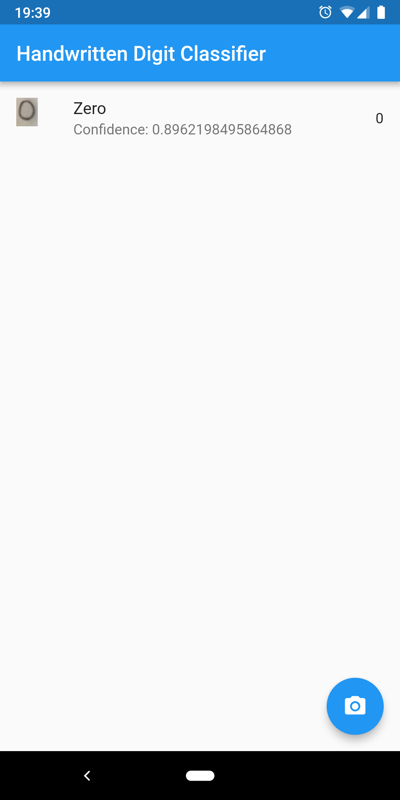

# Handwritten Digit Classifier

## Overview

The Handwritten Digit Classifier is a cross-platform mobile application to capture and classify handwritten digits.
The application leverages Google's mobile UI framework, Flutter, and is completely written in the Dart programming language.
A few Dart packages are used to ease cross-platform resource management:
* [camera](https://pub.dartlang.org/packages/camera) (BSD) - A Flutter plugin for iOS and Android allowing access to the device cameras.
* [tflite](https://pub.dartlang.org/packages/tflite) (MIT) - A Flutter plugin for accessing TensorFlow Lite API. Supports Classification and Object Detection on both iOS and Android.
* [path\_provider](https://pub.dartlang.org/packages/path_provider) (BSD) - A Flutter plugin for finding commonly used locations on the filesystem. Supports iOS and Android.
* [image](https://pub.dartlang.org/packages/image) (Apache 2.0) - A Dart library providing the ability to load, save and manipulate images in a variety of different file formats.

### Author

[David Rogers](https://www.doclrogers.com)

### License

See [LICENSE](LICENSE) file.

## Usage

### Step-by-step Instructions

1. For best results, write a digit with black marker on a white piece of paper.
   * Black or blue pen may work as well, but will likely need to be traced multiple times
2. Launch the "Handwritten Digit Classifier" application
   * 
3. Press the floating camera button to launch the camera
   * You may need to read and accept and camera permissions prompts
4. With sufficient lighting, center the written digit from step 1 onto the screen so that it is centered and takes up roughly 80% of the preview window.
   * Note: The image may be blurry due to how close the camera is to the paper.
   * 
5. Capture the digit with the camera by pressing the blue circle button at the bottom of the application screen.
6. Await the classification processing.
7. View the top classification result on the screen for each image previously captured.
   * 
8. Repeat!

### Available Feature Set

* Maintains scrolling list of all images taken and the classification results.
  * The captured image is rescaled to the size inputted into the neural network and displayed on screen.
  * The classification results indicate the digit recognized and the confidence (a probability in the range [0, 1]) of the recognition.
* Allows user to easily capture unique input via the device camera.
* Leverages artificial intelligence (AI) through the use of a neural network model built in TensorFlow in order to classify input images.
* The neural network model is trained on a variant of the [MNIST handwriten digit database](http://yann.lecun.com/exdb/mnist/) in order to improve ease of deployment and real-world accuracy within a mobile device. See my [notebook](notebooks/MNIST_GaussianNoise_TrainTest.ipynb) for more details.
  * Pixel values are normalized from [0, 255] to [0, 1]
  * Gaussian noise `N(0.3, 0.1)` is added to background pixels and thresholded to [0, 1]
  * Colors are inverted for black writing on white background

### Developer

#### Requirements

* Minimum Android SDK version of 21, target of 28 for best results.

#### Build and Run Commands

* `flutter build apk` - To build and Android APK file.
* `flutter build ios` - To build an iOS application bundle (Mac OS X only).
* `flutter run` - To run on an attached device.
